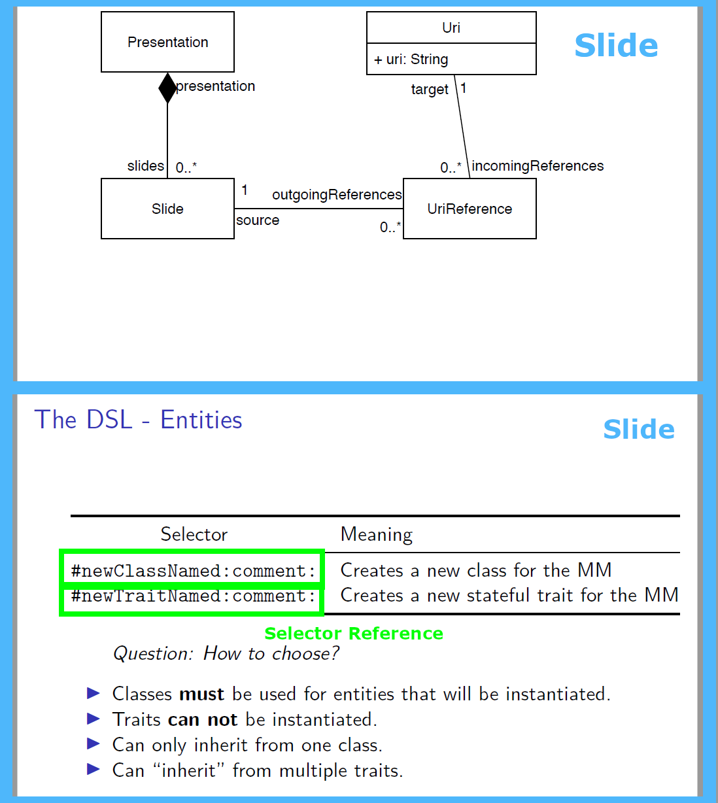
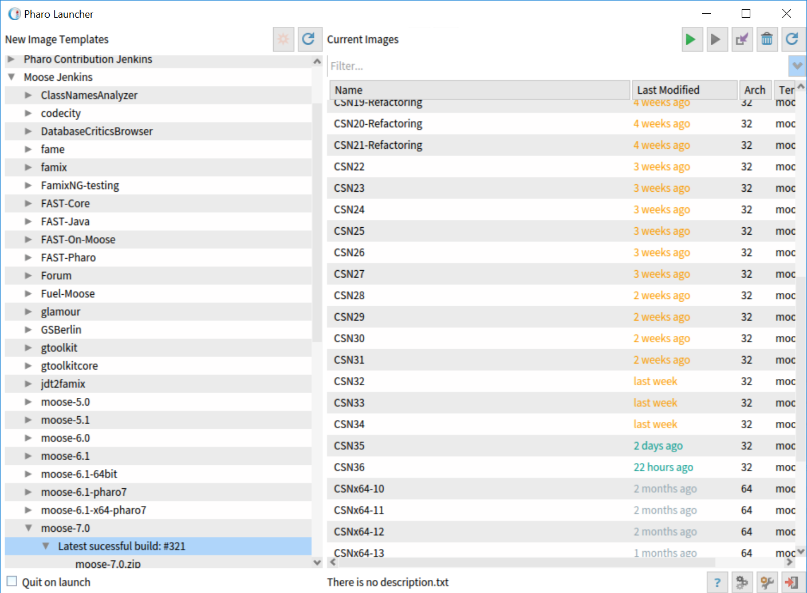

## Introduction

**Objectives**

- Create two linked meta-models
- Extend a meta-model

**Resources**

- [https://github.com/SquareBracketAssociates/Booklet-FamixNG](https://github.com/SquareBracketAssociates/Booklet-FamixNG) (in progress)

# The presentation case

## Let's get back to the past

In the previous presentation


## Possible link

- Which Pharo method are referenced by the presentation?
- How to represent those links?

## Representation of the link

{height=375px}

## Adding reference to a method

{height=250px}

## What do we need

1. A new entity named: 'SelectorReference'
2. A reference to the entity 'Slide'
3. A reference to the entity 'FamixStMethod'
4. A relations between 'Slide' and 'SelectorReference'
5. A relations between 'FamixStMethod' and 'SelectorReference'

## How to do it?

Almost the same as for one meta-model

***BUT***

- The remote entity are defined with `remoteEntity: withPrefix:`
- The class side of the generator should implement `submetamodels` witch return the collection of the remote meta-models.

::: block

### Define remote entity

'`#remoteEntity: anEntityName withPrefix: aPrefixName`' computes the entity 'anEntityName' of the model prefixed by 'aPrefixedName'.

:::

# Let's do it

## Define generator

```st
FamixMetamodelGenerator subclass: #FmxSlideToPharo
  instanceVariableNames: ''
  classVariableNames: ''
  package: 'SlideToPharoBind-Generator'
```

## Define the sub-meta-models

```st
MyGenerator class>>#submetamodels
 ^ { FmxNGSlidesGenerator.
     FamixPharoSmalltalkGenerator }
```

## Define entities

- New entity: 'SelectorReference'
- Reference to 'Slide'
- Reference to 'FamixStMethod'

```st
defineClasses
  super defineClasses.
  selectorReference :=
    builder newClassNamed: #SelectorReference.

  slide := self remoteEntity: #Slide withPrefix: #'Fmx'.

  famixStMethod :=
    self remoteEntity: #Method withPrefix: #'FamixSt'
```

## Define the binding

- Relation between 'Slide' and 'SelectorReference'
- Relation between 'SelectorReference' and 'FamixStMethod'

```st
defineRelations
  super defineRelations.
  
  (slide property: #outgoingReferences) -*
    (selectorReference property: #source).

  (selectorReference property: #candidates) *-*
    (famixStMethod property: #incomingReferences).
```

## Reset the meta-models

```st
FmxNGSlidesGenerator resetMetamodel.
FamixPharoSmalltalkGenerator resetMetamodel.
FamixNGSlidesSmalltalkGenerator resetMetamodel.
```

## So

1. Create new metamodel generator
2. Define the sub-meta-models
3. Define the remote entities
4. Define the new entities (optional)
5. Define the new relations
6. Generate and resetMetamodel

# Tutorial

## Goal

Let's bind the presentation with the Famix Smalltalk meta-model.

## Process

1. Download the last Moose 70 image
2. Download the generator of the presentation meta-model
3. Create the binding generator
4. Create the methods of the new generator
5. Generate the new meta-model

## Download the last Moose 70 image



## Download the generator

```st
Metacello new
  repository:
  'github://juliendelplanque/FamixNG-Slides/src';
  baseline: 'FamixNGSlides';
  load
```

::: block

### You need first to generate the meta-model

`FmxNGSlidesGenerator generate.`

:::

## Create the binding generator

Now it's your turn

{height=250px}

# Examples of binding

## List of examples

- [https://github.com/moostetechnology/FAST-Java](https://github.com/moostetechnology/FAST-Java)
- [https://github.com/badetitou/Carrefour (Binding between Famix and FASTJava)](https://github.com/badetitou/Carrefour.git)
